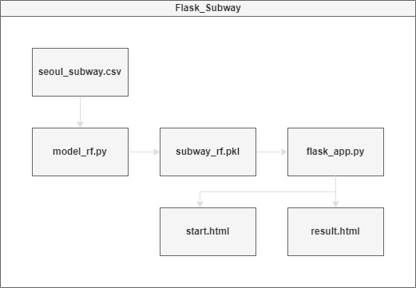
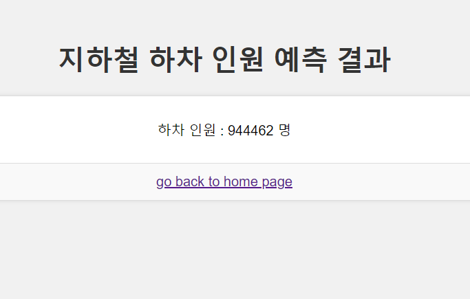

# 서울 지하철역 승하차 인원 예측 프로그램

### 개요
    * 출처 : 서울 열린 데이터 광장 https://data.seoul.go.kr/
    * 서울교통공사 연도별 일별 시간대별 역별 승하차 인원 정보 
    * 시간대 승차 인원을 입력했을 시 하차 인원이 예측되는 구조

### 구조도

    
### 파일 설명
   * flask_app.py : 메인 파일. 플라스크 서버 구동, subway_rf.pkl 모델 파일을 불러와 데이터 처리 및 Html 파일에의 정보 전송 [코드](Flask_Subway/flask_app.py)
   * model_rf.py : subway_rf.pkl 머신모델 제작 프로그램. [코드](Flask_Subway/model_rf.py)
   * subway_rf.pkl : LinearRegression으로 학습된 머신러닝 모델.
   * seoul_subway.csv : 지하철 정보 소스 파일
   * tmplates/start.html : 시작 페이지 [코드](Flask_Subway/templates/start.html)
   * tmplates/result.html : 결과 페이지 [코드](Flask_Subway/templates/result.html)
   * diagram.png : 구조도
   * sample_start.html : 시작 페이지 샘플
   * sample_result.html : 결과 페이지 샘플
    

### 결과

   * [입력](https://likemilktea.github.io/seoul_subway_on_off/Flask_Subway/templates/start.html)
   * [출력](https://likemilktea.github.io/seoul_subway_on_off/Flask_Subway/sample_result.html)

